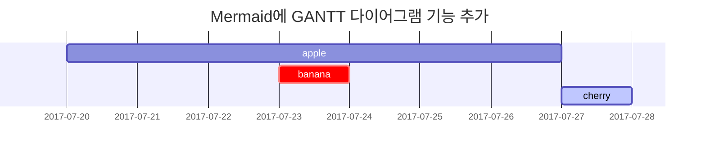

이 포스트는 [**Chirpy**](https://github.com/cotes2020/jekyll-theme-chirpy/fork)에서의 Markdown 구문 렌더링을 보여주기 위한 것이며,
또한 쓰기의 예로 사용할 수 있습니다. 이제 텍스트와 타이포그래피를 살펴보겠습니다.

## 제목

# H1 - 제목
{: .mt-4 .mb-0 }

## H2 - 제목
{: data-toc-skip='' .mt-4 .mb-0 }

### H3 - 제목
{: data-toc-skip='' .mt-4 .mb-0 }

#### H4 - 제목
{: data-toc-skip='' .mt-4 }

## 문단

오늘 하루도 파이팅 넘치게 코드를 불태우려 하였지만 하얗게 불태워진건 나였다.

## 목록

### 순서가 있는 목록

1. Firstly
2. Secondly
3. Thirdly

### 순서가 없는 목록

- Chapter
  + Section
    * Paragraph

### 할 일 목록

- [ ] Job
  + [x] Step 1
  + [x] Step 2
  + [ ] Step 3

### 설명 목록

Sun
: 환한 태양이다. 마치 나와 같은.

Moon
: 달에는 정말 토끼가 산다고 생각하는 사람이 있다.

## 인용문

> 이 줄은 _인용문_ 을 보여줍니다.

## 특징

> `tip` 타입의 예제를 보여주는 예.

{: .prompt-tip }

> `info` 타입의 예제를 보여주는 예.
{: .prompt-info }

> `warning` 타입의 예제를 보여주는 예.
{: .prompt-warning }

> `danger` 타입의 예제를 보여주는 예.
{: .prompt-danger }

## 표

| Company                      | Contact          | Country |
|:-----------------------------|:-----------------|--------:|
| Alfreds Futterkiste          | Maria Anders     | Germany |
| Island Trading               | Helen Bennett    | UK      |
| Magazzini Alimentari Riuniti | Giovanni Rovelli | Italy   |

## 링크

<http://127.0.0.1:4000>

## 각주

각주[^footnote]를 클릭하면 해당 각주로 이동하며, 여기에 또 다른 각주[^fn-nth-2]가 있습니다.

## 인라인 코드

이것은 `인라인 코드`의 예제입니다.

## 파일 경로

다음은 `/path/to/the/file.extend`{: .filepath}의 예제입니다.

## 코드 블록

### 일반

```
이것은 구문 강조와 줄 번호가 없는 일반적인 코드 스니펫입니다.
```

### 특정 언어

```bash
if [ $? -ne 0 ]; then
  echo "The command was not successful.";
  #do the needful / exit
fi;
```

### 특정 파일명

```sass
@import
  "colors/light-typography",
  "colors/dark-typography";
```
{: file='_sass/jekyll-theme-chirpy.scss'}

## 수학

[**MathJax**](https://www.mathjax.org/)에서 제공되는 수학:

$$ \sum_{n=1}^\infty 1/n^2 = \frac{\pi^2}{6} $$

$a \ne 0$일 때, there are two solutions to $ax^2 + bx + c = 0$에 대한 두 해가 있으며

$$ x = {-b \pm \sqrt{b^2-4ac} \over 2a} $$

## Mermaid SVG



## 이미지

### 기본 (캡션 포함)

{: width="972" height="589" }
_전체 화면 너비 및 중앙 정렬_

### 왼쪽 정렬

{: width="972" height="589" .w-75 .normal}

### 왼쪽으로 플로팅

{: width="972" height="589" .w-50 .left}
나랏말싸미 듕귁에 달아 문자와로 서르 사맛디 아니할쎄 이런 전차로 백셩이 니르고져 홀베이셔도 마참네 제 뜨들 시러펴디 몯할 노미하니아 내 이랄 윙하야 어엿비너겨 새로 스믈 여들 짜랄 맹가노니 사람마다 해여 수비니겨 날로 쑤메 뻔한킈 하고져 할따라미니라 닐리리아닐리리아 니나노 닐리리아닐리리아 니나노 삼척서천 산하동색 일휘소탕 혈염산하 휘영청 밝은 달빛 아래 칼을 허리에 차고 행동 계획에는 위험과 대가가 따른다. 하지만 이는 나태하게 아무 행동도 취하지 않는데 따르는 장기간의 위험과 대가에 비하면 훨씬 작다.

### 오른쪽으로 플로팅

{: width="972" height="589" .w-50 .right}
나랏말싸미 듕귁에 달아 문자와로 서르 사맛디 아니할쎄 이런 전차로 백셩이 니르고져 홀베이셔도 마참네 제 뜨들 시러펴디 몯할 노미하니아 내 이랄 윙하야 어엿비너겨 새로 스믈 여들 짜랄 맹가노니 사람마다 해여 수비니겨 날로 쑤메 뻔한킈 하고져 할따라미니라 닐리리아닐리리아 니나노 닐리리아닐리리아 니나노 삼척서천 산하동색 일휘소탕 혈염산하 휘영청 밝은 달빛 아래 칼을 허리에 차고 행동 계획에는 위험과 대가가 따른다. 하지만 이는 나태하게 아무 행동도 취하지 않는데 따르는 장기간의 위험과 대가에 비하면 훨씬 작다.

### Dark/Light 모드 및 그림자

아래 이미지는 테마 기본 설정에 따라 다크/라이트 모드를 전환합니다. 그림자가 있는 것에 주목하세요.

{: .light .w-75 .shadow .rounded-10 w='1212' h='668' }
{: .dark .w-75 .shadow .rounded-10 w='1212' h='668' }

## 비디오



## 역주

[^footnote]: The footnote source
[^fn-nth-2]: The 2nd footnote source